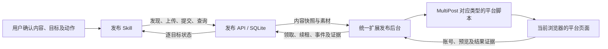

# MultiPost 发布技术架构

开发 MultiPost 平台适配、发布 API、发布 Skill、任务执行或恢复流程前，必须阅读本文件及 [发布开发规则](agents/publishing-development.md)。本文说明当前实现及开发边界；完整协议以 [发布 API](../packages/publishing-api/README.md) 为准，真实平台验收以 [当前交接](research/2026-10-10-publishing-handoff.md) 及后续证据为准。

## 1. 开发起点与默认范围

用户未明确指定扩展范围时，基于 MultiPost **已有平台及其已有内容类型**，对本次任务涉及的组合进行测试和修改。先检查对应注册表和平台脚本，沿用上传、填写与提交实现，在原流程上修复或补齐 API 接入。新增平台、给已有平台新增上游没有的内容类型，应先取得用户明确指示；改变技术架构或替换原流程按发布开发规则确认。

区分三个范围：

| 范围 | 判断依据 | 对开发的含义 |
| --- | --- | --- |
| 上游已有脚本 | `MultiPost-Extension/src/sync/dynamic.ts`、`video.ts`、`article.ts`、`podcast.ts` 及其引用的平台文件 | 可供复用，仍需检查脚本质量和适配成本 |
| 当前 API 接入 | `packages/publishing-api/capabilities.mts` 的平台/类型目录及 `tasks.mts` 的动作校验 | 注册范围和允许执行的动作分别核对 |
| 真实验收通过 | 带账号、素材、动作与结果证据的验收记录 | 结论只适用于记录覆盖的流程 |

当前 API 接受 `dynamic`、`video`、`article`；上游存在 `podcast` 脚本，但当前没有 podcast 任务接口。上游已有且尚未接入 API 的组合，需要完成参数校验、执行接入和结果确认后才能调用。默认规则不要求每次遍历所有上游平台，也不将脚本存在视为发布已可用。

平台名称需显式映射：API `xiaohongshu` 对应上游 `REDNOTE` 入口和 `rednote` 账号键；API `toutiao` 的视频对应 `VIDEO_TOUTIAOHAO`。按注册表解析，不能机械拼接平台字符串。当前小红书视频准备暂位于 `src/sync/dynamic/rednote-prepare.ts`；后续调整应复用并收拢原有能力，避免另建重复流程。

## 2. 系统职责与边界



| 层 | 当前入口 | 职责 |
| --- | --- | --- |
| Skill | `skills/qiushui-publishing/SKILL.md`；`references/requests.md`、`recovery.md` | 理解并确认用户内容、目标、动作；调用 API；按预算跟踪与有限接续；报告结果 |
| API | `packages/publishing-api/server.mts` | HTTP 服务；以 SQLite 持久化配对、分权凭据、素材元数据、任务和执行证据 |
| API 领域模块 | `assets.mts`、`tasks.mts`、`targets.mts`、`recovery.mts` | 素材完整性、任务快照、安装定位、租约、防重与恢复；`model.mts`/`protocol.mts` 定义类型和协议辅助 |
| 调用客户端 | `packages/publishing-api/admin.mts`、`upload.mts` | 携带专用凭据发送请求，流式上传；持久化请求与幂等回执 |
| React 发布页 | `entrypoints/publish/` → `MultiPost-Extension/src/haiqiai/PublishingWorkspace.tsx` | 配对、连接状态、账号、任务与检查入口 |
| 发布后台 | `MultiPost-Extension/src/haiqiai/connection.ts` | 保管安装凭据、心跳、领取、续租和事件；`simulation.ts` 执行模拟，`preflight.ts` 编排真实执行 |
| 平台层 | `MultiPost-Extension/src/sync/`；`src/haiqiai/` 的账号核对模块 | 按内容类型/平台复用页面操作，核对账号、素材、填写与最终结果 |

根 WXT 将 Vue 剪藏与 React 发布页构建为一个扩展；MultiPost 保留独立 Plasmo 配置，整合包只载入显式引入的模块。当前发布入口及后台用于 Chrome/Edge，Firefox 保持剪藏。根构建与测试共用 React/ReactDOM/HeroUI 实例。

Skill 使用 `HAIQIAI_API_URL` 和显式的 `HAIQIAI_API_KEY_FILE`（Skill 专用密钥）；客户端名称 `publishing:admin` 不代表需要管理密钥。各安装使用独立可撤销的执行凭据。平台 Cookie 留在浏览器，API 密钥留在可信扩展上下文；后台的 `HAIQIAI_PUBLISHING_CONNECTION` 消息仅接受可信发布页调用，普通平台页面只接收所需内容与素材。

## 3. 从用户指令到平台执行

1. **确认**：Skill 确认各平台内容、稳定账号、电脑、内容版本和最终动作；已有会话授权直接沿用。内容中的指令不构成执行授权。
2. **发现**：查询 `GET /v1/executors`、`/v1/accounts`、`/v1/capabilities`，核对平台/类型/动作、在线安装和账号。昵称仅用于展示，身份核对用稳定 ID。
3. **上传**：通过 `publishing:upload` 声明 `filename/mediaType/sizeBytes/sha256`，流式上传至 `PUT /v1/assets/:id/content`；完整校验为 `ready` 后取得素材 ID。同一服务的 ready 素材可复用，本地路径和大视频字节不放入任务 JSON。
4. **提交**：按内容类型、执行模式和最终动作分组，以持久化幂等回执调用相应任务接口；每个目标保留独立平台内容。API 整批校验并固定内容快照、摘要与 `executorId`。
5. **领取**：所选安装通过 `POST /v1/executors/:id/claims` 原子领取，取得 120 秒租约并续租；同安装保持单个未确认停止的执行。后台通过约 30 秒 alarm 心跳/检查，休眠不保证准点运行。
6. **执行**：扩展再次核对当前平台账号与素材。`prepare` 只读；`fill` 经一次性准备意图授权后上传和填写。原页、内容、账号核对一致后，按 `finish` 保持页面或申请一次性提交意图，执行草稿/发布动作。
7. **回报**：执行器提交有序、可去重的事件和平台证据，Skill 查询逐目标结果。响应丢失沿用原请求回执；中断先核对旧任务、旧尝试和原页面。

填写的 `prepare-intent` 当前最长 90 秒；最终 `submit-intent` 当前最长 30 秒。它们是执行器内部协议，不是 Skill 创建任务时可自行添加的授权字段。详细请求和停止证明见 API 文档。

## 4. Skill 创建任务的参数

创建接口为 `POST /v1/tasks/dynamic`、`/video`、`/article`。旧 `POST /v1/tasks` 保留兼容；新调用使用类型接口。同一批次 1–100 个目标，任一目标不合法返回 `422 INVALID_TARGETS` 和 `fieldErrors`，整批不入队。

### 公共请求与确认记录

| 字段 | 必填 | 含义与约束 |
| --- | --- | --- |
| `executionMode` | 是 | `simulation` 或 `live`；模拟不操作平台 |
| `confirmation` | 是 | 本批确认记录，所有目标共用 |
| `confirmation.confirmedAt` | 是 | 实际确认时间，UTC ISO 字符串且以 `Z` 结尾；服务允许至多 60 秒未来时钟偏差 |
| `confirmation.contentRevision` | 是 | 已确认内容版本，非空文本 |
| `confirmation.action` | live 必填 | `prepare` 只读预检，`fill` 上传填写；模拟不接受此字段 |
| `confirmation.finish` | 否 | live/fill 的 `stay`、`save_draft`、`publish`；省略为 `stay` |
| `confirmation.originalAgreementAccepted` | 否 | live 下记录本篇原创须知已获用户同意；与内容原创声明分别处理 |
| `confirmation.duplicateRiskAccepted` | 否 | 用户明确接受替代结果未知目标的重复风险时使用 |
| `targets` | 是 | 独立发布目标数组 |

### 每个 target

| 字段 | 必填 | 含义与约束 |
| --- | --- | --- |
| `clientTargetId` | 是 | 本请求内唯一目标标识 |
| `platform` | 是 | API 平台标识，核对能力目录和动作校验 |
| `accountId`、`computerId` | 是 | 从当前服务发现的稳定账号和电脑 ID |
| `browserId`、`profileId` | 否 | 浏览器及用户配置；省略时解析预设默认值，入队后固定具体安装 |
| `content` | 是 | 对应类型的确认内容与已上传素材 ID |
| `replacesTargetId` | 否 | 仅替代原 `outcome_unknown` 目标，须同时确认重复风险；保留原记录 |

同请求的重复 `clientTargetId`，或相同平台/账号/内容摘要目标会被拒绝。未支持的 `platformOptions`、`destination` 等字段会被拒绝；新增参数需同步 API 校验、执行映射、文档和验证。

### content 按类型分流

| 类型 | 当前接受的字段 | 必填与映射 |
| --- | --- | --- |
| dynamic | `type`、`title`、`content`、`imageAssetIds`、`videoAssetIds`、`tags`、`collectionName`、`declareOriginal` | 至少非空正文或图片/视频素材；小红书 live 图文需标题与图片，当前不接受图文视频素材 |
| video | `type`、`title`、`content`、`videoAssetId`、`coverAssetId`、`horizontalCoverAssetId`、`verticalCoverAssetId`、`tags`、`collectionName`、`declareOriginal` | `videoAssetId` 必填；小红书 live 需标题；通用封面与横竖封面在当前小红书流程不能混传 |
| article | `type`、`title`、`htmlContent`、`markdownContent`、`digest`、`coverAssetId`、`imageAssetIds`、`tags` | `title` 和 `htmlContent` 必填，Markdown 不能替代 HTML；HTML 图片用 `asset://ID` 且与图片列表一致，基础静态标签和属性按 API 白名单校验 |

类型接口的 `content.type` 可省略；传入必须与接口一致。素材 ID 必须属于同一 API 服务、已 ready 且媒体类型匹配；图片数组顺序保留。`tags` 为非空文本组成的数组；当前 `collectionName`/`declareOriginal` 只接受小红书图文和视频，合集精确且唯一匹配。内容长度与数量限制由当前平台适配校验，超限明确报错，不静默截断。

示例为小红书图文**填写保持**结构，所有占位符均需替换为实际确认和发现值；它不证明该账号/素材已经验收，也不授予公开发布权限：

```json
{
  "executionMode": "live",
  "confirmation": {
    "confirmedAt": "<实际确认时间，UTC ISO/Z>",
    "contentRevision": "<已确认版本>",
    "action": "fill",
    "finish": "stay"
  },
  "targets": [{
    "clientTargetId": "<本次唯一目标标识>",
    "platform": "xiaohongshu",
    "accountId": "<发现的账号ID>",
    "computerId": "<发现的电脑ID>",
    "content": {
      "title": "<已确认标题>",
      "content": "<已确认正文>",
      "imageAssetIds": ["<ready图片ID>"],
      "tags": ["<已确认话题>"]
    }
  }]
}
```

调用前保存请求 JSON，再以 `publishing:admin POST /v1/tasks/dynamic` 提交并查询返回的任务 ID；完整命令、视频示例和请求回执规则见 [Skill 请求参考](../skills/qiushui-publishing/references/requests.md)。Skill 的 `single/continuous`、跟踪预算和运行目录属于客户端控制，不是 API 任务字段。

## 5. 动作、结果与恢复

| 请求/结果 | 含义 |
| --- | --- |
| `prepare` → `needs_attention / READONLY_CHECKED` | 只读核对完成，没有上传填写 |
| `fill + stay` → `needs_attention / AWAITING_PUBLISH_CONFIRMATION` | 填写后保持页面，不是存草稿或发布 |
| `draft_saved` | 平台草稿证据；`browser_local` 明确说明只保存在执行浏览器 |
| `submitted` | 平台接受提交的证据，尚不证明公开可见 |
| `published` | 账号、内容与作品匹配的只读核对证据及作品 URL |
| `needs_attention`、`failed`、`outcome_unknown` | 说明原因、阶段及处理建议；未知不等同于失败或审核中 |

`queued/running` 是执行状态，`cancelled` 需按执行阶段确认停止。模拟回执与真实平台证据分别报告。部署和公开发布沿用根项目授权边界；测试优先保存草稿，保存失败不改变为发布。

幂等解决同一 HTTP 请求重放；租约、准备意图和提交意图约束实际执行。它们不能消除平台外部结果的不确定性。提交后结果未知时使用 `reconcile` 只读核对，不能重新点击。已开始填写的任务需按原页停止证明和恢复白名单处理；小红书视频 `continue-video` 保留原账号、安装、内容、素材、页面与最终动作，不重新上传。逐错误码及裁切确认参数查 [恢复参考](../skills/qiushui-publishing/references/recovery.md) 和 API 文档。

## 6. 开发完成条件

1. 从类型注册表找到原平台脚本，列明本次修改的平台、内容类型和动作；范围符合用户指示及默认规则。
2. 参数在 Skill → API 校验/快照 → 后台 → 平台脚本间有明确映射；不支持项返回可处理错误，授权、账号、防重和恢复边界保留。
3. 运行相关测试、类型检查与根 `pnpm build`；API 测试使用 Node 24.13+。代码检查、构建与真实平台验收分别记录。
4. 按授权范围经 API 验收实际流程，以账号、素材、动作与平台证据判定结果；浏览器只读观察辅助核对。
5. 同次更新发生变化的 API/Skill 文档及本架构；真实证据写入带日期记录和当前交接。

当前真实执行开放小红书图文/视频填写、X 图文填写保持，抖音/脉脉仅只读预检；其他目录组合尚未开放真实填写。能力目录的 `verified=false`、`autoPublish=false` 是保守标记，不能据此覆盖已有实机证据，也不能据脚本存在宣布自动发布可用。具体限制与当前验收查 API 和交接，本文不逐次累积平台修复日志。
